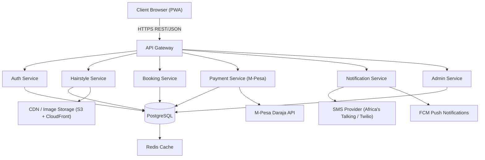
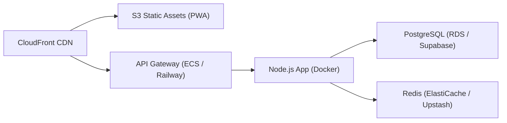
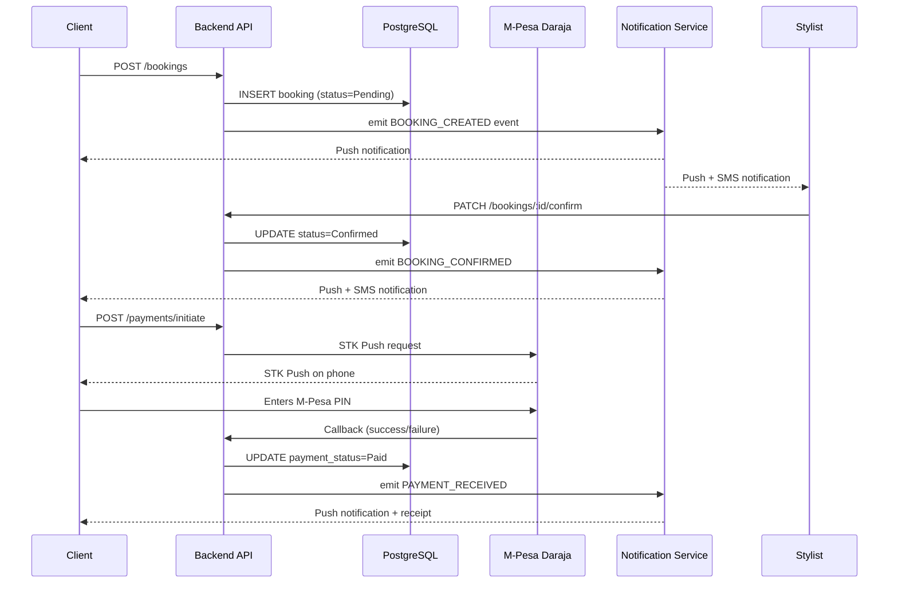
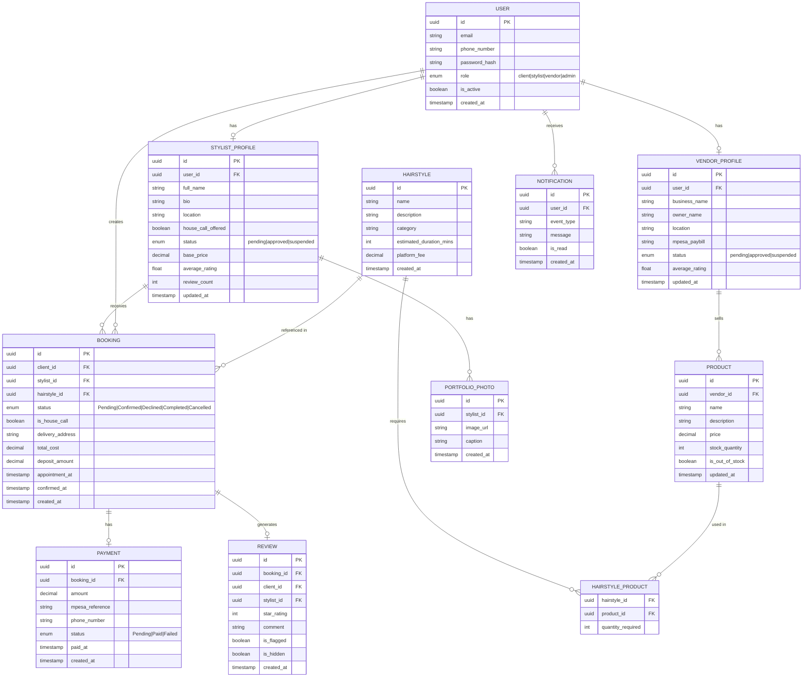

# Design Document

## Overview

HAIRVANA is a mobile-first progressive web application (PWA) targeting young women in Nairobi, Kenya and broader Africa. It serves as a one-stop shop for hairstyle discovery, hair extension recommendations, bundled cost estimation, and connections to verified vendors and hairstylists — with secure M-Pesa payment support.

Three distinct user personas interact with the platform:
- **Clients** ("Rubii") — hairstyle seekers who browse, book, and pay
- **Stylists** ("Hana") — freelance braiders and salon professionals who manage bookings and showcase portfolios
- **Vendors** ("Mary") — hair product sellers who list and manage product inventory

The MVP is designed for lightweight delivery on lower-end Android 8.0+ devices over 3G connections, with local caching for offline browsing.

### Key Design Principles

1. **Mobile-first, data-efficient** — optimised images, lazy loading, aggressive caching, minimal JavaScript bundles
2. **Separation of concerns** — distinct API surface for each persona (client, stylist, vendor, admin)
3. **Event-driven side effects** — booking status changes, payment confirmations, and inventory updates propagate through domain events rather than synchronous chains
4. **Secure by default** — M-Pesa credentials never persisted, JWTs short-lived, all sensitive fields server-side only
5. **Offline resilience** — service worker caches gallery and stylist list for offline browsing

---

## Architecture

### High-Level Architecture



### Technology Stack

| Layer | Technology | Rationale |
|---|---|---|
| Frontend | React (Vite) + TypeScript | Fast builds, tree-shaking, small bundles |
| PWA | Workbox (service worker) | Offline caching strategy |
| Styling | Tailwind CSS | Utility-first, small production CSS |
| Backend | Node.js + Express (TypeScript) | Familiar JS stack, excellent Daraja SDK support |
| Database | PostgreSQL | ACID compliance for payments and bookings |
| Cache | Redis | Session store, rate limiting, inventory cache |
| Image storage | AWS S3 + CloudFront | CDN delivery with compression |
| Payments | M-Pesa Daraja API (STK Push) | Kenya's dominant mobile money rail |
| SMS | Africa's Talking | Pan-African SMS, Kenyan carrier support |
| Push | Firebase Cloud Messaging (FCM) | Free, reliable, works on Android 8+ |
| Auth | JWT (access + refresh tokens) | Stateless, role-based |

### Deployment Architecture



### Request Flow — Booking with Payment



---

## Components and Interfaces

### Frontend Components

#### Core Screens

| Screen | Route | Description |
|---|---|---|
| Home / Discovery | `/` | Featured hairstyles, search bar, category filters |
| Hairstyle Gallery | `/hairstyles` | Filterable grid of hairstyle cards |
| Hairstyle Detail | `/hairstyles/:id` | Full detail: photos, bundle cost, recommended products |
| Stylist List | `/stylists` | Searchable/filterable stylist cards |
| Stylist Profile | `/stylists/:id` | Full profile, portfolio, availability, reviews |
| Vendor List | `/vendors` | Verified vendor list |
| Vendor Profile | `/vendors/:id` | Product catalogue, ratings |
| Booking Flow | `/book/:stylistId` | Time slot selection → summary → payment |
| Payment Screen | `/payments/:bookingId` | M-Pesa STK Push initiation, receipt |
| My Bookings | `/my-bookings` | Client booking history and status |
| Stylist Dashboard | `/stylist/dashboard` | Incoming requests, calendar, earnings |
| Vendor Dashboard | `/vendor/dashboard` | Product management, inventory |
| Admin Dashboard | `/admin` | Verification queue, moderation tools |

#### Reusable UI Components

- `HairstyleCard` — thumbnail, name, category tag, bundle price
- `StylistCard` — photo, name, rating stars, price from, house-call badge
- `VendorCard` — logo, name, verified badge, location
- `BundleCostSummary` — itemised: products subtotal, service fee, platform fee, total
- `StarRating` — interactive (for review submission) and display-only modes
- `BookingStatusBadge` — colour-coded: Pending / Confirmed / Declined / Completed / Cancelled
- `OfflineBanner` — displayed when `navigator.onLine === false`
- `ImageGallery` — lazy-loaded, compressed image carousel
- `FilterPanel` — category, price range, location, hair length filters

### Backend API Endpoints

#### Auth

| Method | Endpoint | Description |
|---|---|---|
| POST | `/auth/register` | Register (client / stylist / vendor) |
| POST | `/auth/login` | Returns access + refresh JWT |
| POST | `/auth/refresh` | Refresh access token |
| POST | `/auth/logout` | Invalidate refresh token |

#### Hairstyles

| Method | Endpoint | Description |
|---|---|---|
| GET | `/hairstyles` | List/search/filter hairstyles |
| GET | `/hairstyles/:id` | Hairstyle detail with bundle cost |
| POST | `/hairstyles` | Admin: create hairstyle |
| PATCH | `/hairstyles/:id` | Admin: update hairstyle |

#### Products & Vendors

| Method | Endpoint | Description |
|---|---|---|
| GET | `/vendors` | List/filter verified vendors |
| GET | `/vendors/:id` | Vendor profile + catalogue |
| POST | `/vendors/:id/products` | Vendor: add product |
| PATCH | `/vendors/:id/products/:pid` | Vendor: update product/stock |

#### Stylists

| Method | Endpoint | Description |
|---|---|---|
| GET | `/stylists` | List/search/filter stylists |
| GET | `/stylists/:id` | Stylist profile |
| PATCH | `/stylists/:id` | Stylist: update profile, pricing, availability |
| POST | `/stylists/:id/portfolio` | Upload portfolio photos |

#### Bookings

| Method | Endpoint | Description |
|---|---|---|
| POST | `/bookings` | Client: create booking |
| GET | `/bookings/:id` | Get booking detail |
| PATCH | `/bookings/:id/confirm` | Stylist: confirm booking |
| PATCH | `/bookings/:id/decline` | Stylist: decline booking |
| PATCH | `/bookings/:id/cancel` | Client: cancel booking |
| PATCH | `/bookings/:id/complete` | Mark booking completed |

#### Payments

| Method | Endpoint | Description |
|---|---|---|
| POST | `/payments/initiate` | Trigger M-Pesa STK Push |
| POST | `/payments/callback` | M-Pesa Daraja webhook |
| GET | `/payments/:bookingId/receipt` | Payment receipt |

#### Reviews

| Method | Endpoint | Description |
|---|---|---|
| POST | `/reviews` | Client: submit review |
| GET | `/stylists/:id/reviews` | List reviews for stylist |

#### Admin

| Method | Endpoint | Description |
|---|---|---|
| GET | `/admin/applications` | Pending stylist/vendor applications |
| PATCH | `/admin/applications/:id/approve` | Approve application |
| PATCH | `/admin/applications/:id/reject` | Reject with reason |
| PATCH | `/admin/accounts/:id/suspend` | Suspend account |
| PATCH | `/admin/accounts/:id/reinstate` | Reinstate account |
| PATCH | `/admin/reviews/:id/remove` | Remove flagged review |

### Service Layer Interfaces

```typescript
// Booking Service
interface BookingService {
  createBooking(clientId: string, stylistId: string, slot: TimeSlot, isHouseCall: boolean, address?: string): Promise<Booking>;
  confirmBooking(bookingId: string, stylistId: string): Promise<Booking>;
  declineBooking(bookingId: string, stylistId: string, reason?: string): Promise<Booking>;
  cancelBooking(bookingId: string, clientId: string): Promise<Booking>;
  completeBooking(bookingId: string): Promise<Booking>;
  autoExpireBookings(): Promise<void>; // cron: runs every 15 min
}

// Payment Service
interface PaymentService {
  initiateSTKPush(bookingId: string, amount: number, phoneNumber: string): Promise<STKPushResponse>;
  handleCallback(payload: MpesaCallbackPayload): Promise<void>;
  getReceipt(bookingId: string): Promise<PaymentReceipt>;
}

// Bundle Cost Calculator
interface BundleCostCalculator {
  calculate(hairstyleId: string, stylistId?: string): Promise<BundleCost>;
}

// Notification Service
interface NotificationService {
  send(userId: string, event: NotificationEvent): Promise<void>;
  sendSMS(phoneNumber: string, message: string): Promise<void>;
}
```

---

## Data Models

### Entity Relationship Diagram



### Key Data Model Notes

- `USER.role` drives API authorization middleware; a user can have exactly one role at registration
- `STYLIST_PROFILE.status` / `VENDOR_PROFILE.status` gates visibility: only `approved` profiles appear in Client-facing results
- `PAYMENT` does not store M-Pesa PINs or raw credentials — only the Daraja-returned `mpesa_reference`
- `REVIEW.is_hidden` is set by Admin moderation; hidden reviews are excluded from all queries and rating recalculations
- `BOOKING` stores `total_cost` at booking time (snapshot) to prevent retroactive price changes affecting existing bookings
- `HAIRSTYLE_PRODUCT` is the join table enabling the bundle cost calculation: `SUM(product.price * quantity_required)` + stylist service fee + platform fee

### Caching Strategy

| Data | Cache TTL | Invalidation Trigger |
|---|---|---|
| Hairstyle gallery (first page) | 5 min (Redis) | Admin updates hairstyle |
| Stylist list (first page) | 5 min (Redis) | Stylist profile update |
| Product stock status | 1 hr (Redis) | Vendor marks product out-of-stock |
| Bundle cost for hairstyle | 1 hr (Redis) | Product price or stylist fee change |
| Service worker (offline) | Until network available | PWA cache-first for gallery/stylist list |


---

## Correctness Properties

*A property is a characteristic or behavior that should hold true across all valid executions of a system — essentially, a formal statement about what the system should do. Properties serve as the bridge between human-readable specifications and machine-verifiable correctness guarantees.*

---

### Property 1: Filter results always satisfy all active filter predicates

*For any* collection of hairstyles, stylists, or vendors, and for any combination of active filter parameters (category, price range, location, service type, hair length), every item returned by the filtered query must satisfy every active filter predicate simultaneously. No item may appear in results that fails any single active filter.

**Validates: Requirements 1.2, 3.5, 4.2, 5.3**

---

### Property 2: Search results always contain the search keyword

*For any* keyword and any dataset of hairstyles, every item returned by a keyword search must have a name or description that contains the keyword (case-insensitive). No item whose name and description both omit the keyword may appear in search results.

**Validates: Requirements 1.3**

---

### Property 3: Required fields are always present in entity responses

*For any* hairstyle, stylist profile, vendor profile, or product record, the API response for that entity must include all mandatory display fields: hairstyle responses must include name, at least one photo URL, category, estimated duration, and bundle cost; stylist responses must include name, photo, service types, starting price, average rating, review count, and house_call_offered; vendor responses must include name, logo, location, product categories, and average rating; product responses must include name, photos, description, price, and vendor profile.

**Validates: Requirements 1.1, 1.4, 2.1, 2.3, 4.1, 4.3, 4.4, 5.1, 5.2**

---

### Property 4: Bundle cost arithmetic is always correct

*For any* hairstyle, any set of associated products with quantities and prices, and any stylist with a specific service fee, the bundle cost total must equal exactly: `SUM(product.price × quantity_required) + stylist.service_fee + hairstyle.platform_fee`. Each component must be itemised separately, and no price component may be omitted or approximated. After any update to product prices or stylist fees, subsequent bundle cost queries must reflect the updated prices.

**Validates: Requirements 3.1, 3.2, 3.3, 3.4, 8.5**

---

### Property 5: Visibility gate — only approved accounts appear in client-facing results

*For any* stylist or vendor account, if its status is `pending` or `suspended`, it must not appear in any client-facing search results, filter results, or hairstyle recommendation results. Only accounts with status `approved` may appear in client-facing queries. A "Verified" badge must be present on every vendor with status `approved` and absent on all others.

**Validates: Requirements 5.4, 5.5, 8.2, 8.6, 9.2, 9.5**

---

### Property 6: Every recommended product has at least one verified vendor, or is marked out-of-stock

*For any* product that appears in a hairstyle's recommendation list, either (a) at least one vendor associated with that product has status `approved`, or (b) the product must carry the `is_out_of_stock` indicator. A product with all linked vendors either unverified or with zero stock must display an out-of-stock indicator and must not be presented as purchasable.

**Validates: Requirements 2.2, 2.4**

---

### Property 7: Booking state machine transitions are valid and consistent

*For any* booking, the following invariants must hold:
- A newly created booking must always have status `Pending`
- A `Pending` booking after a stylist confirm action must have status `Confirmed`
- A `Pending` booking after a stylist decline action must have status `Declined`
- A `Confirmed` booking after a complete action must have status `Completed`
- A `Pending` booking that has been waiting for more than 24 hours must be automatically set to `Cancelled`
- For any house-call booking (is_house_call=true), the `delivery_address` field must be non-null and non-empty

**Validates: Requirements 6.1, 6.2, 6.3, 6.4, 6.6, 6.7**

---

### Property 8: Cancellation eligibility is determined by time remaining before appointment

*For any* booking in `Confirmed` status, if the current time is more than 24 hours before the appointment time, a cancellation request must succeed and the booking status must become `Cancelled`. For any `Confirmed` booking where fewer than 24 hours remain until the appointment, the cancellation policy must be applied.

**Validates: Requirements 6.5**

---

### Property 9: M-Pesa STK Push always uses the correct amount and phone number

*For any* payment initiation request, the parameters forwarded to the M-Pesa Daraja API must include exactly the booking's due amount (full Bundle cost or deposit amount as selected) and exactly the client's registered phone number. No substitution, rounding, or truncation of amount or phone number is permitted.

**Validates: Requirements 7.2**

---

### Property 10: Payment callback correctly transitions payment and booking status

*For any* M-Pesa success callback payload, the corresponding payment record must be updated to status `Paid`, and the payment receipt must include: amount paid, M-Pesa reference number, date, time, and booking details. For any deposit payment, the displayed remaining balance must equal exactly `total_cost - amount_already_paid`.

**Validates: Requirements 7.3, 7.5, 7.6**

---

### Property 11: Review submission is gated on booking completion and one-per-booking uniqueness

*For any* booking with status other than `Completed`, any review submission attempt by the associated client must be rejected. *For any* booking with status `Completed`, the first review submission from the associated client must succeed. A second review submission from the same client for the same booking must be rejected, regardless of the content.

**Validates: Requirements 10.1, 10.3**

---

### Property 12: Stylist average rating is always the arithmetic mean of all non-hidden reviews

*For any* stylist with one or more non-hidden reviews, the value of `stylist.average_rating` must equal the arithmetic mean of all `star_rating` values from reviews where `is_hidden = false`. Flagged reviews (is_flagged=true) must not appear in any public review list and must not be included in rating calculations until an Admin explicitly un-flags or reinstates them.

**Validates: Requirements 10.4, 10.5**

---

### Property 13: Registration validation rejects payloads with missing required fields

*For any* stylist or vendor registration payload that omits any required field (e.g., full name, phone number, profile photo for stylists; business name, M-Pesa paybill for vendors), the API must return a validation error and must not create the account. For any complete and valid registration payload, the account must be created with status `pending`.

**Validates: Requirements 8.1, 9.1**

---

### Property 14: Previously cached content is accessible when offline

*For any* hairstyle gallery page or stylist list that has been previously loaded and stored in the service worker cache, after the device enters offline mode (navigator.onLine = false), those resources must still be retrievable from the cache and rendered to the user. The offline indicator must be visible whenever the device is offline.

**Validates: Requirements 12.4**

---

## Error Handling

### API Error Response Format

All API errors follow a consistent JSON shape:

```json
{
  "error": {
    "code": "BOOKING_NOT_FOUND",
    "message": "The requested booking could not be found.",
    "details": {}
  }
}
```

### Error Categories and Handling

| Category | HTTP Status | Examples | Behaviour |
|---|---|---|---|
| Validation errors | 400 | Missing required field, invalid rating value | Return field-level errors; do not create record |
| Authentication | 401 | Invalid/expired JWT | Return 401; client must re-authenticate |
| Authorisation | 403 | Client trying to confirm a booking | Return 403; log the attempt |
| Not found | 404 | Booking/hairstyle/stylist not found | Return 404 with entity type |
| Conflict | 409 | Duplicate review submission | Return 409 with conflict reason |
| Payment failure | 402 | M-Pesa STK timeout, user decline | Return 402; allow client to retry |
| Rate limiting | 429 | Too many payment initiation attempts | Return 429 with retry-after header |
| Server error | 500 | Unexpected DB error | Return 500; log internally; do not leak stack traces |

### M-Pesa Payment Error Handling

```mermaid
flowchart TD
    A[Client initiates payment] --> B[STK Push sent]
    B --> C{Callback received?}
    C -->|Yes, success| D[Mark Paid, send receipt]
    C -->|Yes, failure / declined| E[Mark Failed, show error, allow retry]
    C -->|No callback within 60s| F[Poll Daraja Query API]
    F --> G{Status?}
    G -->|Paid| D
    G -->|Failed| E
    G -->|Pending| H[Display "payment processing" and retry option]
```

### Booking Auto-Expiry

A scheduled job runs every 15 minutes. It selects all bookings where `status = 'Pending'` AND `created_at < NOW() - INTERVAL '24 hours'`, updates their status to `Cancelled`, and emits a `BOOKING_AUTO_CANCELLED` notification event for each. This ensures the auto-expiry invariant (Property 7) is enforced without relying on the client.

### Offline Error Handling

- All API calls wrapped in a `try/catch` with a network-error detector
- On network error: serve cached data if available; display `OfflineBanner` component
- Write operations (booking creation, payment initiation) that fail offline are not queued — the user is informed to retry when online
- The service worker uses a **cache-first** strategy for the hairstyle gallery and stylist list, and a **network-first** strategy for booking and payment endpoints

### Input Sanitisation

- All text inputs (bio, review text, product descriptions) are sanitised with a whitelist HTML policy before storage
- Phone numbers are validated against E.164 format before M-Pesa STK Push is triggered
- Image uploads are validated for MIME type and file size (max 5 MB per photo) before storage

---

## Testing Strategy

### Overview

The testing strategy combines unit tests, property-based tests, integration tests, and smoke tests to provide comprehensive coverage matching the dual-testing approach.

### Property-Based Testing

**Library:** [fast-check](https://github.com/dubzzz/fast-check) (TypeScript/JavaScript PBT library)

**Configuration:** Each property test runs a minimum of **100 iterations** with randomised inputs.

**Tag format:** `Feature: hairvana, Property {N}: {property_text}`

Each correctness property (1–14) above maps to exactly one property-based test in the test suite. The test generators will produce:

| Generator | Produces |
|---|---|
| `fc.record({...})` | Random hairstyle, stylist, vendor, product, booking, review objects |
| `fc.array(...)` | Random-length arrays of entities |
| `fc.oneof(...)` | Random filter parameter combinations |
| `fc.string()` | Random search keywords |
| `fc.integer({min:1,max:5})` | Random star ratings |
| `fc.boolean()` | Random house-call flag |
| `fc.date()` | Random appointment timestamps |

**Example property test structure:**

```typescript
// Feature: hairvana, Property 4: Bundle cost arithmetic is always correct
import fc from 'fast-check';
import { calculateBundleCost } from '../services/bundleCost';

describe('Property 4: Bundle cost arithmetic', () => {
  it('total equals sum of components for any product set and stylist', () => {
    fc.assert(
      fc.property(
        fc.array(
          fc.record({ price: fc.float({ min: 0.01 }), quantity: fc.integer({ min: 1, max: 10 }) }),
          { minLength: 1 }
        ),
        fc.float({ min: 0 }),   // stylistFee
        fc.float({ min: 0 }),   // platformFee
        (products, stylistFee, platformFee) => {
          const result = calculateBundleCost(products, stylistFee, platformFee);
          const expectedSubtotal = products.reduce((sum, p) => sum + p.price * p.quantity, 0);
          expect(result.productsSubtotal).toBeCloseTo(expectedSubtotal);
          expect(result.serviceFee).toBeCloseTo(stylistFee);
          expect(result.platformFee).toBeCloseTo(platformFee);
          expect(result.total).toBeCloseTo(expectedSubtotal + stylistFee + platformFee);
        }
      ),
      { numRuns: 100 }
    );
  });
});
```

### Unit Tests

Unit tests cover:
- Specific examples and happy-path scenarios
- Edge cases: empty gallery, stylist with no reviews, out-of-stock products
- Error conditions: invalid JWT, duplicate review, missing required fields
- M-Pesa callback parsing for both success and failure payloads
- Booking state machine — invalid transitions (e.g., cannot confirm a Cancelled booking)

Unit tests are kept focused and do **not** duplicate what property tests already cover broadly. Target: ~2–3 unit tests per endpoint for concrete examples.

### Integration Tests

Integration tests verify:
- End-to-end booking flow: create → confirm → pay → complete → review
- M-Pesa STK Push and callback round-trip (using Daraja sandbox)
- Notification delivery via Africa's Talking sandbox and FCM test project
- Cache invalidation: after vendor marks product out-of-stock, product detail reflects change
- Admin approval flow: pending → approved → profile visible in client search
- Service worker caching: gallery loads from cache after simulated offline

### Smoke Tests

Run on every deployment:
- Health check endpoint (`GET /health`) returns 200
- Database connection is active
- Redis connection is active
- M-Pesa Daraja credentials are configured (not testing actual transaction)
- FCM project credentials are configured
- No raw credential fields present in the database schema (`password_pin`, `mpesa_pin` must not exist as columns)

### Performance Tests

- Lighthouse CI on primary screens: TTI < 5 seconds on simulated 3G
- Image bundle audit: 20 hairstyle thumbnails must total < 2 MB
- Run on every PR targeting main branch

### Test File Organisation

```
src/
  __tests__/
    unit/
      bundleCost.test.ts
      bookingStateMachine.test.ts
      reviewValidation.test.ts
      filterPredicates.test.ts
      mpesaCallback.test.ts
    property/
      property1-filter-results.test.ts
      property2-search-keyword.test.ts
      property3-required-fields.test.ts
      property4-bundle-arithmetic.test.ts
      property5-visibility-gate.test.ts
      property6-product-vendor-link.test.ts
      property7-booking-state-machine.test.ts
      property8-cancellation-eligibility.test.ts
      property9-mpesa-stk-params.test.ts
      property10-payment-callback.test.ts
      property11-review-gating.test.ts
      property12-rating-arithmetic.test.ts
      property13-registration-validation.test.ts
      property14-offline-cache.test.ts
    integration/
      booking-flow.integration.test.ts
      payment-flow.integration.test.ts
      admin-approval.integration.test.ts
      cache-invalidation.integration.test.ts
    smoke/
      health.smoke.test.ts
      credentials.smoke.test.ts
```
